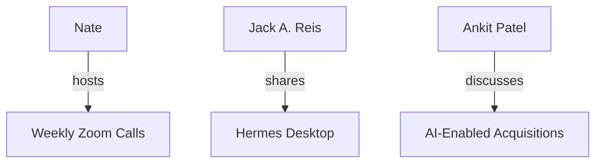

# Exec Circle Knowledge Graph Integration

## Overview
The **Exec Circle Knowledge Graph (KG)** captures participants, topics, resources, and actions from collaborative discussions (e.g., Exec Circle, fleet coordination). This reference documents how to integrate KG updates into the `session-close-ritual` workflow.

## Workflow

### 1. **Extract Entities**
- **Participants**: Extract names and roles from the transcript.
- **Topics**: Identify key themes (e.g., AI strategy, memory systems).
- **Resources**: List shared files, links, and tools.
- **Actions/Decisions**: Document follow-ups and community actions.

### 2. **Update the KG**
- **Nodes**: Add new participants, topics, or resources.
- **Edges**: Define relationships (e.g., `mentions`, `shares`, `decides`).
- **Visualization**: Generate a Mermaid.js graph and embed it in `index.md`.

### 3. **Verify Relationships**
- Use the `smart-graph` skill to check for orphaned notes or disconnected nodes.
- Ensure the KG is **versioned** (e.g., `index_v2.md`) to avoid overwrites.

### 4. **Export to Shared Vault**
- Save the KG to a shared vault (e.g., `~/Documents/exec-circle-kg/index.md`).
- For high-impact sessions, export to a **dashboard** or **Obsidian vault**.

## Pitfalls

- **Parallel Session Overwrites**: Multiple agents may update the KG simultaneously. Mitigate by:
  - Running a **weekly sprint retro** to reconcile conflicts.
  - Using **sequential execution** for high-risk tasks.
- **Orphaned Notes**: Ensure all nodes are connected to the KG. Use `smart-graph` to verify.

## Example

